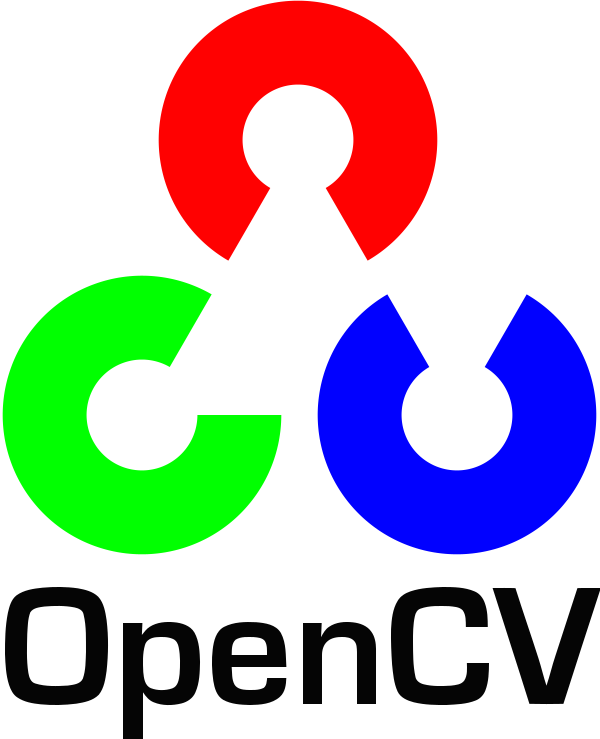
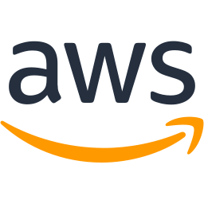

### Hi 👋, I'm a Research student in Computer Vision

I am looking for **6-months end-of-study internship** or a **Research Engineer** position in **Reinforcement Learning** or **Computer Vision**. It would start ideally around the beginning of April 2023.

### TLDR;

- ✨ Open-Source Contributor of [AlphaZero.jl](https://github.com/jonathan-laurent/AlphaZero.jl)
- 🔬 Research on Self-Supervised Natural Language Processing
- 💻 Double Master's degree @ Epita & Sorbonne in Computer Vision
- 🔥 Interested in Reinforcement Learning, Computer Vision & High Performance Computing
- 🚴 Love Cycling, Climbing & Chess
- 🇬🇧 Speaking English & French

### 🛠️ My Skills
         

### 🎓 My Background

I discovered artificial intelligence (AI) and the world of research simultaneously during my first internship in the AI laboratory of my school. This internship aimed to improve the detection of malicious traffic in the core of a network using **Machine Learning** methods. My contribution allowed me to **reduce by 50% the errors** of the previous model.

I recently contributed to the **Open-Source** community through a **Google Summer of Code**. Created by Google Deepmind, [AlphaZero](https://www.deepmind.com/blog/alphazero-shedding-new-light-on-chess-shogi-and-go) is a **Reinforcement Learning** algorithm that has remarkably pushed the state of the art in chess, Go, and Shogi. [AlphaZero.jl](https://github.com/jonathan-laurent/AlphaZero.jl) aims to provide an accessible & powerful Open-Source version of this algorithm. Coordinated by its primary maintainer, I **parallelized in CUDA** the environment exploration. I developed the **Deep Reinforcement Learning** of an optimal game strategy and a latent representation of the game space.

I have continuously learned about these topics for the past four years. During my studies at **Epita** and my double master's degree at the **Sorbonne**, I specialized in **Machine Learning** and **Deep Learning** methods applied to **Computer Vision**. At the same time, I joined **Epita's Research and Development Laboratory**. I am developing tools to automatically detect and correct texts extracted from old documents. Next January, we hope to **publish a paper** on a self-supervised approach using a sequence-to-sequence model (**BERT**) applied to this problem. These 18 months have been an opportunity to deepen my **research** background and to discover another aspect of Deep Learning: **Natural Language Processing**.

I value **teamwork** and **effective communication** within a team. I was able to practice the latter when I co-organized a discussion group on AI safety for nine months and was president of Epita's chess club for three years. I am **autonomous**, **hardworking**, and **passionate**. By actively contributing to developing these technologies, I hope to become one of the critical actors in the following decades.

### 📊 Github's Statistics

### 📫 How to reach me:
- Mail - [guillaume1.thomas@protonmail.com](mailto:guillaume1.thomas@protonmail.com)
- LinkedIn - [@guillaume-thomas](https://www.linkedin.com/in/guillaume-thomas/)
- Phone - (+33) 6 17 28 50 87
