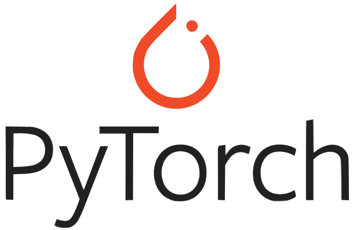

### Hi 👋, I'm a Research student in Artificial Intelligence & Robotics

### TLDR;

- ✨ Open-Source Contributor of [AlphaZero.jl](https://github.com/jonathan-laurent/AlphaZero.jl): `13x` speed improvement
- 🔬 Research on Distributed **Reinforcement Learning** in Robotics & Self-Supervised **Natural Language Processing** @ LRDE & CEA (France)
- 💻 Double CS Master and Engineering degree @ Epita & Sorbonne in **Computer Vision**
- 🔥 Interested in Reinforcement Learning, Computer Vision & High Performance Computing
- 🚴 Love Cycling, Climbing & Piano
- 🇬🇧 Speaking English & French

### 🛠️ My Skills
        

### 🎓 My Background
I was introduced to the world of AI and **research** during my first internship in my school's AI laboratory, where I used Machine Learning (**sklearn**) methods to improve the detection of malicious traffic in network cores. My contribution led to a **50% reduction in errors** compared to the previous model.

Recently, I contributed to the Open-Source community through the **Google Summer of Code** program. [AlphaZero](https://www.deepmind.com/blog/alphazero-shedding-new-light-on-chess-shogi-and-go), an algorithm developed by Google Deepmind, has made significant advancements in the fields of chess, Go, and Shogi through its Reinforcement Learning approach. To make this algorithm more accessible, [AlphaZero.jl](https://github.com/jonathan-laurent/AlphaZero.jl) has been created as a powerful **Open-Source** implementation of this algorithm in Julia. I parallelized the environment exploration using **CUDA**, which resulted in a **13x speedup** compared to the previous implementation, as described in this [accessible Medium article](https://medium.com/@guillaume.thopas/an-almost-full-gpu-implementation-of-gumbel-muzero-in-julia-1d64b2ec04ca).

During my studies in France at Epita and my double master's degree at the Sorbonne, I specialized in Machine Learning and Deep Learning methods for **Computer Vision**, extensively experimenting with **Tensorflow** and **PyTorch** Framework. Meanwhile, I joined Epita's Research and Development Laboratory, where I am researching and developing tools to automatically detect and correct texts extracted from old documents. My latest project involves a supervised approach using a sequence-to-sequence model (BERT), which we plan to **publish a paper** on in May. This experience has allowed me to deepen my research background and gain experience with **RNNs** and **Transformers** in the **Natural Language Processing** context. To explore further details about this project, please feel free to consult my final report, [available here](https://github.com/Whojo/Self-Supervised-Neural-Machine-Translation).

Further on the path of computational resources optimization, I am currently undertaking a research internship at the French Alternative Energies and Atomic Energy Commission. In this position, I am responsible for **distributing** the computing load for training a state-based **Reinforcement Learning** algorithm, which is being used to control a multi-task robotic arm, by utilizing **Jax** (\cite{jax}). The goal of this project is to reduce the current four-day training time down to just one hour, resulting in a significant **100x speedup**. This acceleration will greatly enhance our ability to iterate through experiments and generate meaningful results, in the hope to reproduce results of [SayCan](https://say-can.github.io/) with fewer resources.

In addition to my academic pursuits, I am also involved in several side-projects, including the President of my School's Chess club, Co-Organizer of an AI Safety discussion group, Head of my school's Student Office Events, and participation in Reinforcement Learning side-courses.

I value **teamwork** and **effective communication** within a team. I was able to practice the latter when I co-organized a discussion group on AI safety for nine months and was president of Epita's chess club for three years. I am **autonomous**, **hardworking**, and **passionate**. By actively contributing to developing these technologies, I hope to become one of the critical actors in the following decades.

### 📊 Github's Statistics

### 📫 How to reach me:
- Mail - [guillaume1.thomas@protonmail.com](mailto:guillaume1.thomas@protonmail.com)
- LinkedIn - [@guillaume-thomas](https://www.linkedin.com/in/guillaume-thomas/)
- Phone - (+33) 6 17 28 50 87
